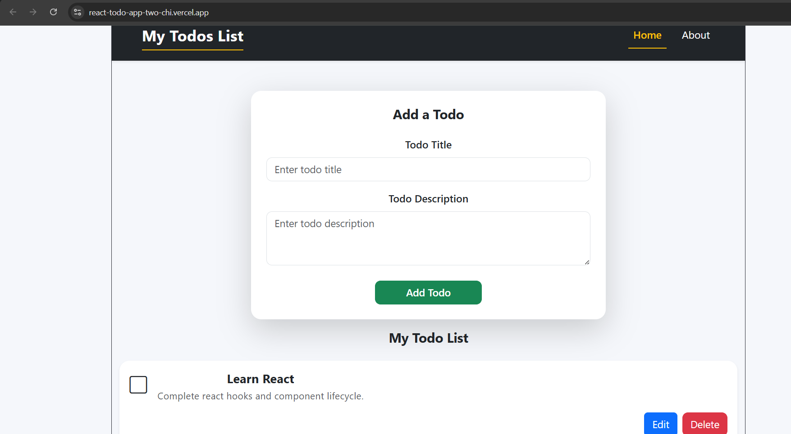
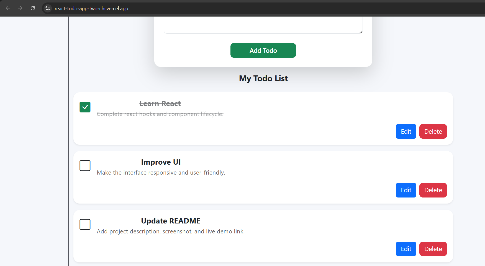

# 📝 React Todo App

A clean and responsive Todo application built with **React** and **Vite**. It helps users organize their daily tasks by allowing them to add, edit, delete, and mark tasks as completed. All todos are automatically saved using **Local Storage**, so your data remains available even after refreshing the page.

---

## 🚀 Live Demo

🔗 **https://react-todo-app-two-chi.vercel.app/**

---

## ✨ Features

- ➕ Add new tasks
- ✏️ Edit existing tasks
- 🗑️ Delete tasks
- ✅ Mark tasks as completed
- 💾 Automatically saves tasks using Local Storage
- 🏠 Easy navigation between Home and About pages
- 📱 Clean and responsive user interface

---

## 📸 Screenshots

### 🏠 Home Page



### 📋 Todo List



---

## 🛠️ Technologies Used

- React
- Vite
- React Router
- Bootstrap 5
- JavaScript (ES6)
- HTML5
- CSS3

---

## 📂 Getting Started

### 1. Clone the repository

```bash
git clone https://github.com/kushal214/React-todo-app.git
```

### 2. Navigate to the project folder

```bash
cd React-todo-app
```

### 3. Install dependencies

```bash
npm install
```

### 4. Start the development server

```bash
npm run dev
```

Open your browser and visit:

```text
http://localhost:5173
```

---

## 📁 Project Structure

```text
react-todo-app/
│
├── public/
├── screenshots/
│   ├── home-page.png
│   └── todo-list.png
│
├── src/
│   ├── components/
│   │   ├── About.jsx
│   │   ├── AddTodo.jsx
│   │   ├── Home.jsx
│   │   ├── TodoItem.jsx
│   │   └── Todos.jsx
│   │
│   ├── App.jsx
│   ├── Header.jsx
│   ├── App.css
│   ├── index.css
│   └── main.jsx
│
├── README.md
├── package.json
└── vite.config.js
```

---

## 👨‍💻 Author

**Kushal Pan**

- GitHub: https://github.com/kushal214

---

⭐ If you like this project, consider giving it a **star** on GitHub!